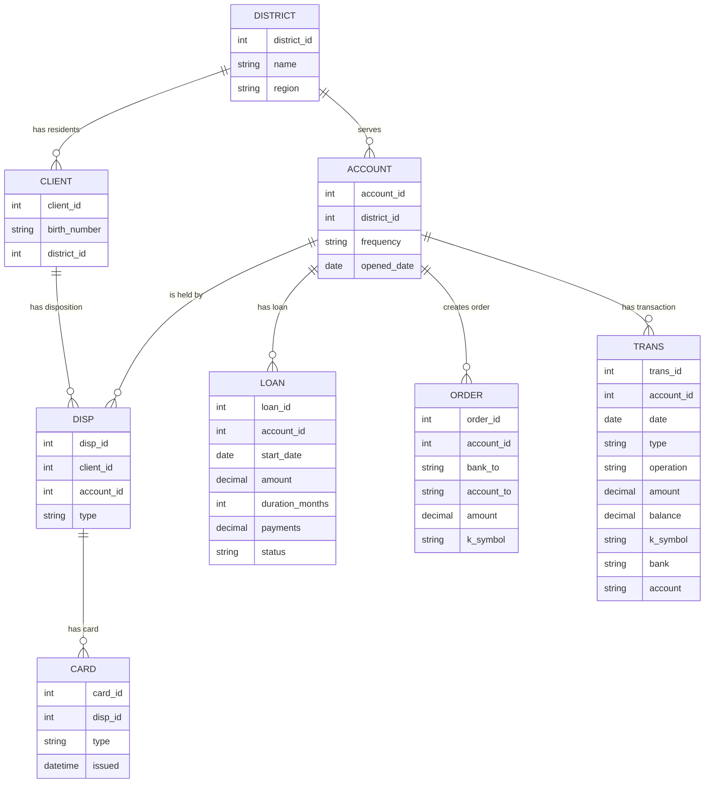

# Berka Banking Dataset (`./data`)

This folder contains the Berka Czech bank dataset used for the CDP Public Cloud POC. Each CSV represents an entity in the retail banking domain (clients, accounts, products, and transactions).

## Files and Schemas

- `account.csv`  
  - **Purpose:** Bank accounts held by clients.  
  - **Key fields:**  
    - `account_id` – unique account identifier.  
    - `district_id` – link to the client’s geographic district (see `district.csv`).  
    - `frequency` – statement frequency (e.g. monthly fee payments).  
    - `date` – account creation/opening date.

- `card.csv`  
  - **Purpose:** Payment cards issued on accounts.  
  - **Key fields:**  
    - `card_id` – unique card identifier.  
    - `disp_id` – link to disposition/role on an account (see `disp.csv`).  
    - `type` – card type (e.g. classic, gold).  
    - `issued` – card issuance timestamp.

- `client.csv`  
  - **Purpose:** Bank clients (customers).  
  - **Key fields:**  
    - `client_id` – unique client identifier.  
    - `birth_number` – encoded birth date / demographic key.  
    - `district_id` – home district (links to `district.csv`).

- `disp.csv`  
  - **Purpose:** Dispositions – the relationship between clients and accounts.  
  - **Key fields:**  
    - `disp_id` – unique disposition identifier.  
    - `client_id` – link to `client.csv`.  
    - `account_id` – link to `account.csv`.  
    - `type` – role of the client on the account (e.g. OWNER, DISPOSER).

- `district.csv`  
  - **Purpose:** Reference data describing geographic districts.  
  - **Notes:**  
    - Columns `A1`–`A16` capture attributes such as region name, population, unemployment, crime statistics, and other socio‑economic indicators used for segmentation and analytics.

- `loan.csv`  
  - **Purpose:** Loans associated with accounts.  
  - **Key fields:**  
    - `loan_id` – unique loan identifier.  
    - `account_id` – link to `account.csv`.  
    - `date` – loan start/approval date.  
    - `amount` – principal amount of the loan.  
    - `duration` – loan duration (in months).  
    - `payments` – regular installment amount.  
    - `status` – loan status/quality flag (e.g. paid, default).

- `order.csv`  
  - **Purpose:** Payment orders initiated from accounts.  
  - **Key fields:**  
    - `order_id` – unique payment order identifier.  
    - `account_id` – source account.  
    - `bank_to` – destination bank code.  
    - `account_to` – destination account identifier.  
    - `amount` – transfer amount.  
    - `k_symbol` – payment/contract code (e.g. SIPO, UVER).

- `trans.csv`  
  - **Purpose:** Detailed account transaction history.  
  - **Key fields:**  
    - `trans_id` – unique transaction identifier.  
    - `account_id` – link to `account.csv`.  
    - `date` – transaction posting date.  
    - `type` – direction of transaction (e.g. PRIJEM = credit, VYDAJ = debit).  
    - `operation` – operation type (e.g. deposit, withdrawal, transfer).  
    - `amount` – transaction amount.  
    - `balance` – resulting account balance after the transaction.  
    - `k_symbol` – purpose code / reference.  
    - `bank`, `account` – counterparty bank and account (if applicable).

These structures form the core relational model for the POC: clients live in districts, hold accounts, are linked via dispositions, can have cards and loans, and generate orders and transactions that drive downstream analytics, BI, and ML use cases in CDP.

## Logical ER Model

At a logical level:
- `district` defines geographic areas for both `client` and `account`.  
- `client` is linked to `account` through `disp` (disposition), which captures each client’s role on an account.  
- `card` is issued at the `disp` level (one disposition may have zero or more cards).  
- `loan`, `order`, and `trans` are all financial events tied directly to an `account`.

