# Berka Banking Demo

This project demonstrates an end‑to‑end banking data pipeline on CDP Public Cloud using the Berka dataset. It shows how raw CSVs flow into a lakehouse (Bronze/Silver/Gold with Iceberg), are enriched into dimensions and facts, and are then consumed by streaming and BI workloads.

---

## 1. Repository Layout

```text
.
├── POC Steps.md                # High-level POC narrative and stages
├── agents.md                   # Project instructions / coding conventions
├── data/                       # Berka CSVs (source dataset)
├── readme.md                   # This document
├── scripts/
│   ├── etl/                    # Spark ETL jobs (dimensions, facts, Customer360)
│   ├── bi/                     # Trino BI queries (simple/medium/complex)
│   ├── kafka_data_generator/   # Berka Kafka streaming data generator
│   └── init/                   # Bootstrap scripts (DBs, schemas, Kafka, HBase, ADLS)
├── cml/                        # ML pipeline scripts (training, batch + real-time scoring)
└── (bronze/silver/gold DBs)    # Created in the metastore by ETL jobs
```

---

## 2. Source Dataset (`./data`)

The Berka dataset is a collection of Czech bank data: customers, accounts, transactions, loans, cards, and districts.

### 2.1 Files and Schemas

- `account.csv`  
  - **Purpose:** Bank accounts held by clients.  
  - **Key fields:**  
    - `account_id` – unique account identifier.  
    - `district_id` – link to the client’s geographic district (see `district.csv`).  
    - `frequency` – statement frequency (e.g. monthly fee payments).  
    - `date` – account creation/opening date.

- `card.csv`  
  - **Purpose:** Payment cards issued on accounts.  
  - **Key fields:**  
    - `card_id` – unique card identifier.  
    - `disp_id` – link to disposition/role on an account (see `disp.csv`).  
    - `type` – card type (e.g. classic, gold).  
    - `issued` – card issuance timestamp.

- `client.csv`  
  - **Purpose:** Bank clients (customers).  
  - **Key fields:**  
    - `client_id` – unique client identifier.  
    - `birth_number` – encoded birth date / demographic key.  
    - `district_id` – home district (links to `district.csv`).

- `disp.csv`  
  - **Purpose:** Dispositions – the relationship between clients and accounts.  
  - **Key fields:**  
    - `disp_id` – unique disposition identifier.  
    - `client_id` – link to `client.csv`.  
    - `account_id` – link to `account.csv`.  
    - `type` – role of the client on the account (e.g. OWNER, DISPOSER).

- `district.csv`  
  - **Purpose:** Reference data describing geographic districts.  
  - **Notes:**  
    - Columns `A1`–`A16` capture attributes such as region name, population, unemployment, crime statistics, and other socio‑economic indicators used for segmentation and analytics.

- `loan.csv`  
  - **Purpose:** Loans associated with accounts.  
  - **Key fields:**  
    - `loan_id` – unique loan identifier.  
    - `account_id` – link to `account.csv`.  
    - `date` – loan start/approval date.  
    - `amount` – principal amount of the loan.  
    - `duration` – loan duration (in months).  
    - `payments` – regular installment amount.  
    - `status` – loan status/quality flag (e.g. paid, default).

- `order.csv`  
  - **Purpose:** Payment orders initiated from accounts.  
  - **Key fields:**  
    - `order_id` – unique payment order identifier.  
    - `account_id` – source account.  
    - `bank_to` – destination bank code.  
    - `account_to` – destination account identifier.  
    - `amount` – transfer amount.  
    - `k_symbol` – payment/contract code (e.g. SIPO, UVER).

- `trans.csv`  
  - **Purpose:** Detailed account transaction history.  
  - **Key fields:**  
    - `trans_id` – unique transaction identifier.  
    - `account_id` – link to `account.csv`.  
    - `date` – transaction posting date.  
    - `type` – direction of transaction (e.g. PRIJEM = credit, VYDAJ = debit).  
    - `operation` – operation type (e.g. deposit, withdrawal, transfer).  
    - `amount` – transaction amount.  
    - `balance` – resulting account balance after the transaction.  
    - `k_symbol` – purpose code / reference.  
    - `bank`, `account` – counterparty bank and account (if applicable).

These structures form the core relational model for the POC: clients live in districts, hold accounts, are linked via dispositions, can have cards and loans, and generate orders and transactions that drive downstream analytics, BI, and ML use cases in CDP.

### 2.2 Date Conventions

- Historic dates in the original Berka CSVs have been re-based to the year 2025 so that the dataset looks “current” for the POC (for example, `930101` → `250101`, corresponding to 2025‑01‑01).  
- Date fields remain encoded as `YYMMDD` (or `YYMMDD hh:mm:ss` for card issue timestamps), preserving original month/day patterns while shifting the calendar year.

---

## 3. Core Logical ER Model

At a logical level:
- `district` defines geographic areas for both `client` and `account`.  
- `client` is linked to `account` through `disp` (disposition), which captures each client’s role on an account.  
- `card` is issued at the `disp` level (one disposition may have zero or more cards).  
- `loan`, `order`, and `trans` are all financial events tied directly to an `account`.


---

## 4. Lakehouse Architecture (Bronze / Silver / Gold)

The same entities are modeled across:
- **Bronze** – raw/staged (NiFi‑landed CSVs and Kafka streams).  
- **Silver** – cleaned and typed Parquet tables (with data quality capture).  
- **Gold** – curated Iceberg tables (dimensions with SCD2, facts optimized for BI).

### 4.1 Lakehouse Layers ER

```mermaid
erDiagram
    %% Dimensions
    B_CLIENT ||--o{ S_CLIENT : "cleansed to"
    S_CLIENT ||--o{ DIM_CLIENT : "SCD2 to"

    B_ACCOUNT ||--o{ S_ACCOUNT : "cleansed to"
    S_ACCOUNT ||--o{ DIM_ACCOUNT : "SCD2 to"

    B_DISTRICT ||--o{ S_DISTRICT : "cleansed to"
    S_DISTRICT ||--o{ DIM_DISTRICT : "SCD2 to"

    B_DISP ||--o{ S_DISP : "cleansed to"
    S_DISP ||--o{ DIM_DISP : "SCD2 to"

    B_CARD ||--o{ S_CARD : "cleansed to"
    S_CARD ||--o{ DIM_CARD : "SCD2 to"

    %% Facts
    KAFKA_LOAN ||--o{ F_LOAN_SILVER : "streamed to"
    F_LOAN_SILVER ||--o{ F_LOAN_GOLD : "Iceberg fact"

    KAFKA_ORDER ||--o{ F_ORDER_SILVER : "streamed to"
    F_ORDER_SILVER ||--o{ F_ORDER_GOLD : "Iceberg fact"

    KAFKA_TRANS ||--o{ F_TRANS_SILVER : "streamed to"
    F_TRANS_SILVER ||--o{ F_TRANS_GOLD : "Iceberg fact"

    %% Dim–fact relationships in Gold
    DIM_CLIENT ||--o{ DIM_ACCOUNT : "holds account"
    DIM_ACCOUNT ||--o{ F_LOAN_GOLD : "loan on account"
    DIM_ACCOUNT ||--o{ F_ORDER_GOLD : "order on account"
    DIM_ACCOUNT ||--o{ F_TRANS_GOLD : "trans on account"

    B_CLIENT {
      string layer "bronze"
      string table "bronze.client_bronze"
    }
    S_CLIENT {
      string layer "silver"
      string table "silver.client_silver"
    }
    DIM_CLIENT {
      string layer "gold"
      string table "gold.dim_client"
    }

    B_ACCOUNT {
      string layer "bronze"
      string table "bronze.account_bronze"
    }
    S_ACCOUNT {
      string layer "silver"
      string table "silver.account_silver"
    }
    DIM_ACCOUNT {
      string layer "gold"
      string table "gold.dim_account"
    }

    B_DISTRICT {
      string layer "bronze"
      string table "bronze.district_bronze"
    }
    S_DISTRICT {
      string layer "silver"
      string table "silver.district_silver"
    }
    DIM_DISTRICT {
      string layer "gold"
      string table "gold.dim_district"
    }

    B_DISP {
      string layer "bronze"
      string table "bronze.disp_bronze"
    }
    S_DISP {
      string layer "silver"
      string table "silver.disp_silver"
    }
    DIM_DISP {
      string layer "gold"
      string table "gold.dim_disp"
    }

    B_CARD {
      string layer "bronze"
      string table "bronze.card_bronze"
    }
    S_CARD {
      string layer "silver"
      string table "silver.card_silver"
    }
    DIM_CARD {
      string layer "gold"
      string table "gold.dim_card"
    }

    KAFKA_LOAN {
      string source "kafka.berka_loans"
    }
    F_LOAN_SILVER {
      string layer "silver"
      string table "silver.fact_loan_silver"
    }
    F_LOAN_GOLD {
      string layer "gold"
      string table "gold.fact_loan"
    }

    KAFKA_ORDER {
      string source "kafka.berka_orders"
    }
    F_ORDER_SILVER {
      string layer "silver"
      string table "silver.fact_order_silver"
    }
    F_ORDER_GOLD {
      string layer "gold"
      string table "gold.fact_order"
    }

    KAFKA_TRANS {
      string source "kafka.berka_trans"
    }
    F_TRANS_SILVER {
      string layer "silver"
      string table "silver.fact_trans_silver"
    }
    F_TRANS_GOLD {
      string layer "gold"
      string table "gold.fact_trans"
    }
```



---

## 5. Dimension Pipelines

All dimension ETL jobs live under `scripts/etl` and use Spark SQL only.

### 5.1 Bronze → Silver (Parquet + DQ)

Bronze→Silver jobs clean and type data into Parquet and, when data quality (DQ) rules fail, write offending rows into daily DQ tables.

- District: `scripts/etl/dim_district_bronze_to_silver.py`  
  - Outputs `silver.district_silver`; DQ rows go to `silver.dq_district`.
- Client: `scripts/etl/dim_client_bronze_to_silver.py`  
  - Outputs `silver.client_silver`; enforces `district_id` FK to `silver.district_silver`.  
  - DQ rows (invalid IDs, missing `birth_number`, unknown `district_id`) go to `silver.dq_client`.
- Account: `scripts/etl/dim_account_bronze_to_silver.py`  
  - Outputs `silver.account_silver`; enforces `district_id` FK to `silver.district_silver`.  
  - DQ rows (invalid IDs, bad `date`, unknown `district_id`) go to `silver.dq_account`.
- Disp: `scripts/etl/dim_disp_bronze_to_silver.py`  
  - Outputs `silver.disp_silver`; cleans malformed IDs and types.  
  - DQ rows go to `silver.dq_disp`.
- Card: `scripts/etl/dim_card_bronze_to_silver.py`  
  - Outputs `silver.card_silver`; validates card IDs, disp IDs, type, and issued timestamp.  
  - DQ rows go to `silver.dq_card`.

Example:
- `spark-submit scripts/etl/dim_client_bronze_to_silver.py \`
  ` --bronze-db bronze --silver-db silver \`
  ` --bronze-table client_bronze --silver-table client_silver`

### 5.2 Silver → Gold (Iceberg SCD2)

Silver→Gold jobs maintain SCD Type 2 Iceberg dimensions with `effective_from`, `effective_to`, `is_current`, and `scd_version`.

- District: `scripts/etl/dim_district_silver_to_gold.py` → `gold.dim_district`  
- Client: `scripts/etl/dim_client_silver_to_gold.py` → `gold.dim_client` (FK to `gold.dim_district`)  
- Account: `scripts/etl/dim_account_silver_to_gold.py` → `gold.dim_account` (FK to `gold.dim_district`)  
- Disp: `scripts/etl/dim_disp_silver_to_gold.py` → `gold.dim_disp` (depends on `dim_client` and `dim_account`)  
- Card: `scripts/etl/dim_card_silver_to_gold.py` → `gold.dim_card` (depends on `dim_disp`)

Example:
- `spark-submit scripts/etl/dim_client_silver_to_gold.py \`
  ` --silver-db silver --gold-db gold \`
  ` --silver-table client_silver --gold-table dim_client`

### 5.3 Dimension Load Order and PK/FK Checks

To satisfy primary/foreign key relationships and the built‑in DQ checks:

1. **Bronze → Silver (dimensions)**  
   1. `dim_district_bronze_to_silver.py` – establishes `silver.district_silver` (district PKs).  
   2. `dim_client_bronze_to_silver.py` – loads `silver.client_silver` and only keeps rows whose `district_id` exists in `silver.district_silver`.  
   3. `dim_account_bronze_to_silver.py` – loads `silver.account_silver` and enforces `district_id` FK to `silver.district_silver`.  
   4. `dim_disp_bronze_to_silver.py` – cleans dispositions after client/account are present in silver.  
   5. `dim_card_bronze_to_silver.py` – cleans card data after `disp` is available.

2. **Silver → Gold (dimensions, Iceberg SCD2)**  
   1. `dim_district_silver_to_gold.py` – builds `gold.dim_district`.  
   2. `dim_client_silver_to_gold.py` – builds `gold.dim_client` (FK to `gold.dim_district`).  
   3. `dim_account_silver_to_gold.py` – builds `gold.dim_account` (FK to `gold.dim_district`).  
   4. `dim_disp_silver_to_gold.py` – builds `gold.dim_disp` and must run after `dim_client` and `dim_account`.  
   5. `dim_card_silver_to_gold.py` – builds `gold.dim_card` after `dim_disp`.

### 5.4 Airflow‑Style Dimension DAG


---

## 6. Streaming Pipelines (Kafka → Silver → Gold)

### 6.1 Kafka Data Generator

The Berka streaming generator sends synthetic loan, order, and transaction events to Kafka topics.

- Script: `scripts/kafka_data_generator/berka_data_generator.py` (requires `kafka-python` and a reachable Kafka broker).

Example:
- `python3 scripts/kafka_data_generator/berka_data_generator.py \`
  ` --bootstrap-servers localhost:9092 \`
  ` --loan-topic berka_loans --order-topic berka_orders --trans-topic berka_trans \`
  ` --interval-seconds 10 --batch-size 10`

### 6.2 Fact Streaming Jobs (Loan / Order / Trans)

Three Spark Structured Streaming jobs consume Kafka topics and build fact tables:

- Loan fact: `scripts/etl/fact_loan_streaming.py`  
  - Reads from `--loan-topic` (default `berka_loans`).  
  - Writes to `silver.fact_loan_silver` (Parquet, Snappy) and `gold.fact_loan` (Iceberg).

- Order fact: `scripts/etl/fact_order_streaming.py`  
  - Reads from `--order-topic` (default `berka_orders`).  
  - Writes to `silver.fact_order_silver` and `gold.fact_order`.

- Transaction fact: `scripts/etl/fact_trans_streaming.py`  
  - Reads from `--trans-topic` (default `berka_trans`).  
  - Writes to `silver.fact_trans_silver` and `gold.fact_trans`.

Each job:
- Uses Structured Streaming with a micro-batch trigger (`--trigger-seconds`, default `30`).  
- Uses `foreachBatch` and Spark SQL to load silver and join to `gold.dim_account` before inserting into the Iceberg gold fact.  
- Requires a checkpoint location (`--checkpoint-location`) for state and exactly-once guarantees.

Example (loan fact):
- `spark-submit scripts/etl/fact_loan_streaming.py \`
  ` --bootstrap-servers localhost:9092 --loan-topic berka_loans \`
  ` --silver-db silver --silver-table fact_loan_silver \`
  ` --gold-db gold --gold-table fact_loan \`
  ` --checkpoint-location /tmp/berka_fact_loan_chk \`
  ` --trigger-seconds 30`

### 6.3 Airflow‑Style Fact DAG


Recommended runtime order:
1. Run NiFi to populate bronze tables from `./data`.  
2. Run dimension bronze→silver and silver→gold jobs to build Iceberg dimensions.  
3. Start the Kafka data generator for loans/orders/trans.  
4. Start the three fact streaming jobs to continuously populate silver and gold fact tables.

---

## 7. Customer 360 (HBase)

To demonstrate a real-time Customer 360 view, a dedicated streaming job consumes live loan, order, and transaction events, enriches them with Iceberg dimensions, and writes one row per customer into HBase via REST.

- Script: `scripts/etl/customer_360_hbase_streaming.py`  
  - Reads from `--loan-topic`, `--order-topic`, and `--trans-topic`.  
  - Joins against `gold.dim_client` and `gold.dim_account` (current SCD2 versions).  
  - Produces a “latest activity” snapshot per `client_id` and upserts to HBase.

Example:
- `spark-submit scripts/etl/customer_360_hbase_streaming.py \`
  ` --bootstrap-servers localhost:9092 \`
  ` --loan-topic berka_loans --order-topic berka_orders --trans-topic berka_trans \`
  ` --gold-db gold \`
  ` --checkpoint-location /tmp/berka_customer360_chk \`
  ` --hbase-rest-url http://hbase-rest-host:8080 \`
  ` --hbase-table customer360 \`
  ` --trigger-seconds 30`

### 7.1 Customer 360 Flow (Mermaid)


---

## 8. Machine Learning Pipeline (CML + MLflow)

A simple “poor man’s” ML pipeline uses CML notebooks/scripts, PyTorch, Trino, and MLflow to train and serve a loan default classifier.

- Training script: `cml/train_loan_default_pytorch.py`  
  - Pulls features directly from `gold.fact_loan` via Trino (`amount`, `duration`, `payments`, `status`).  
  - Trains a small feed‑forward network in PyTorch and logs runs to MLflow (including model artifacts).

- Batch scoring: `cml/batch_score_loans.py`  
  - Reads features from `gold.fact_loan` via Trino.  
  - Applies a saved model and writes scored results (predicted status and probabilities) back into `gold.loan_default_scores` for run‑wise accuracy tracking.

- Real‑time scoring service: `cml/realtime_scoring_service.py`  
  - Loads a trained model at startup.  
  - Exposes `/score` for JSON payloads (`amount`, `duration`, `payments`) and returns predictions in JSON.

### 8.1 ML Flowchart (Mermaid)


